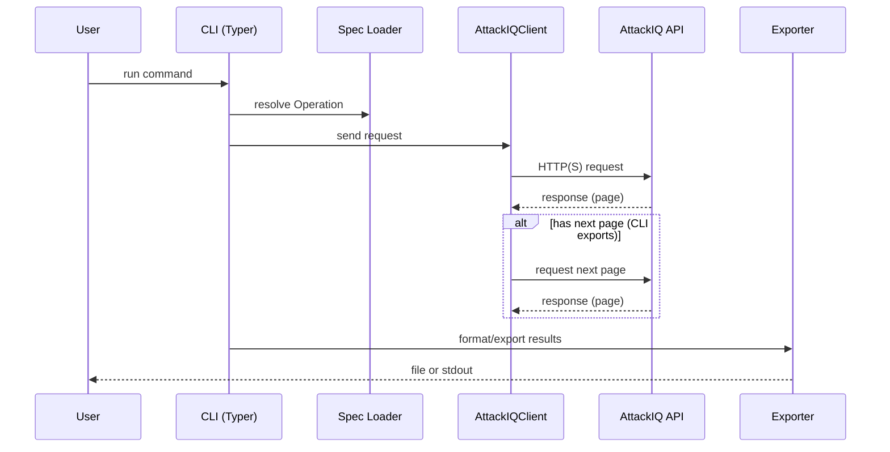

# Architecture Overview

## Purpose
The AttackIQ CLI provides a secure, schema-driven command line interface to the AttackIQ API.
It loads a bundled OpenAPI schema, validates parameters, and executes API requests with
safe defaults (timeouts, TLS verification, redacted logging).
The CLI defines capabilities, then abstractions. The TUI consumes those abstractions and
adds UI affordances while keeping endpoint interaction in shared services.

## System Context
- Users invoke `attackiq` commands locally.
- The CLI reads configuration and tokens from disk/env.
- Requests are sent to the AttackIQ API over HTTP(S).
- http:// base URLs are permitted when configured; TLS/insecure mode is surfaced in runtime diagnostics.
- The joiner consumes exported CSVs (AttackIQ + GitLab) and produces deterministic CSV outputs.

```mermaid
flowchart TD
    User[User CLI invocation] --> CLI[src/attackiq_cli/cli.py + cli_*.py + __main__.py]
    CLI --> Services[src/attackiq_cli/services.py]
    Services --> Config[src/attackiq_cli/config.py]
    Services --> Spec[src/attackiq_cli/spec.py + src/attackiq_cli/openapi.yaml]
    Services --> Client[src/attackiq_cli/client.py]
    Client --> API[AttackIQ API]
    Config --> Services
    Spec --> Services
    CLI --> Exporter[src/attackiq_cli/exporter.py]
    TUI --> Exporter
    Exporter --> Output[CSV/JSON files]
    TUI[TUI (tui.py)] --> Services
    Joiner[Joiner (joiner/*)] --> Output
    CLI --> Output
    Client --> Logging[logging_utils.py]
```

## Major Components
- CLI app wiring: `src/attackiq_cli/cli.py`, `src/attackiq_cli/__main__.py`
- CLI command families: focused `src/attackiq_cli/cli_*.py` modules
- TUI entrypoint: `src/attackiq_cli/tui.py`
- Configuration: `src/attackiq_cli/config.py`
- OpenAPI parsing: `src/attackiq_cli/spec.py` and bundled `src/attackiq_cli/openapi.yaml`
- API client + pagination: `src/attackiq_cli/client.py`
- Export workflows: `src/attackiq_cli/exporter.py`
- Joiner workflows: `src/attackiq_cli/joiner/*` (deterministic CSV joins)
- Service layer: `src/attackiq_cli/services.py`
- Logging utilities: `src/attackiq_cli/logging_utils.py`
- Utilities: `src/attackiq_cli/utils.py`
- Compatibility alias package: `src/aiq_cli/*` (backwards-compatible module path)

## Module Responsibilities
- `src/attackiq_cli/cli.py`: top-level Typer app assembly, global callback/version/completion
  behavior, command registration, and compatibility imports for previously monolithic command
  symbols.
- `src/attackiq_cli/cli_call.py`: generic `attackiq call` command parsing, OpenAPI request
  validation, dry-run previews, response formatting, and ad hoc request execution.
- `src/attackiq_cli/cli_export.py`: `export` Typer command family, pagination orchestration,
  export option validation, optional scenario enrichment, and JSON/CSV output handling.
- `src/attackiq_cli/cli_scenarios.py`: `scenarios` Typer command family, list/show/upload option
  validation, backend selection, package upload redaction, and JSON/CSV output handling.
- `src/attackiq_cli/cli_assessments.py`: `assessments` Typer command family, read-only
  list/detail output handling, dry-run/apply assessment mutations, and assessment defaults
  orchestration.
- `src/attackiq_cli/cli_tests.py`: `tests` Typer command family, read-only list/detail output
  handling, dry-run/apply test mutations, and test status orchestration.
- `src/attackiq_cli/cli_join.py`: top-level `join` command option validation and dispatch into
  dataset and DET pipeline joiner workflows.
- `src/attackiq_cli/cli_tui.py`: top-level `tui` command option validation and launch handoff to
  the Textual app.
- `src/attackiq_cli/cli_backup.py`: read-only `backup configs` Typer command family for redacted
  tenant configuration capture and manifest/artifact status output.
- `src/attackiq_cli/cli_build.py`: no-network `build` Typer command family for generating
  assessment/test request payloads and suggested `attackiq call` commands.
- `src/attackiq_cli/cli_config.py`: `config` and `auth` Typer command family for local
  configuration display, validation, save, token storage, and secret masking.
- `src/attackiq_cli/cli_catalog.py`: local read-only `catalog` Typer command family for BAS
  catalog validation, normalized listing, and coverage summaries.
- `src/attackiq_cli/cli_platform_api.py`: experimental read-only `platform-api parity` Typer
  command family for comparing native and Platform API scenario/asset list IDs.
- `src/attackiq_cli/cli_scenario_wizard.py`: local `scenario-wizard` Typer command family for
  runtime inspect/validate/prepare and create/package dry-run/apply UX over Scenario Wizard
  helpers.
- `src/attackiq_cli/cli_spec.py`: read-only `spec` Typer command family for listing, searching,
  and showing bundled OpenAPI operations.
- `src/attackiq_cli/__main__.py`: CLI entrypoint wiring and version output.
- `src/attackiq_cli/tui.py`: Textual-based terminal UI for status,
  scenario/assessment/test/asset/settings list-detail workflows, and results views built on
  services abstractions.
- `src/attackiq_cli/tui_domains.py`: read-only TUI domain-controller metadata for tab switching,
  command palette availability, focus prefixes, and filter-help text.
- `src/attackiq_cli/config.py`: load/save config, env overrides, validation helpers.
- `src/attackiq_cli/spec.py`: parse OpenAPI, construct `Operation` objects, parameter lookup.
- `src/attackiq_cli/client.py`: HTTP client, auth header selection, safe-method retries, pagination
  helpers.
- `src/attackiq_cli/exporter.py`: export routines and formatting for datasets.
- `src/attackiq_cli/service_core.py`, `src/attackiq_cli/services.py`, and focused
  `src/attackiq_cli/services_*.py` modules: shared orchestration for config/spec/client usage,
  domain query builders, summary records, and read-only fetch helpers across CLI and TUI.
- `src/attackiq_cli/services_assessment_tests.py`: assessment and test filter normalization,
  summary records, read-only list/detail helpers, and TUI page fetch helpers.
- `src/attackiq_cli/services_mutations.py`: assessment/test apply-mode service calls, synthetic
  operation builders for out-of-spec endpoints, and mutation response normalization.
- `src/attackiq_cli/mutation_plans.py`: pure assessment/test mutation call-plan builders shared by
  CLI dry-runs and future TUI previews.
- `src/attackiq_cli/tui_mutation_preview.py`: read-only TUI mutation preview model and redaction
  helpers for in-memory call-plan rendering without client or apply hooks.
- `src/attackiq_cli/services_assets.py`: asset filter normalization, summary records, native and
  Platform API read-only list helpers, and TUI page/detail fetch helpers.
- `src/attackiq_cli/services_asset_groups.py`: asset-group filter normalization, summary records,
  read-only list pagination, and detail fetch helpers for `v1_asset_groups_*`.
- `src/attackiq_cli/services_blueprints.py`: blueprint filter normalization, summary records, and
  read-only list fetch helper for `v1_blueprints_list`.
- `src/attackiq_cli/services_integrations.py`: integration connector filter normalization,
  configuration-safe summary records, and read-only list fetch helper for
  `v1_company_connectors_list`.
- `src/attackiq_cli/services_results.py`: results mode query selection, validation-result filters,
  read-only result list fetches, validation-result fetches, and phase result/log join helpers.
- `src/attackiq_cli/services_scenarios.py`: scenario filter normalization, summary records,
  read-only native and Platform API list behavior, detail fetches, and health checks.
- `src/attackiq_cli/services_templates.py`: assessment-template and template-test filter
  normalization, summary records, TUI page/detail helpers, and read-only list fetch helpers.
- `src/attackiq_cli/backup_artifacts.py`: redacted backup payload handling, artifact JSON writing,
  endpoint-catalog redaction classification checks, and file permission tightening.
- `src/attackiq_cli/backup_fetchers.py`: configuration-backup domain fetchers, endpoint-catalog
  read-only fetch execution, pagination validation, and source-type request derivation.
- `src/attackiq_cli/scenario_wizard_package.py`: Scenario Wizard package dry-run planning,
  fixture-backed apply execution, runtime site-package linking, dependency copying, and package
  result collection.
- `src/attackiq_cli/scenario_wizard_process.py`: allowlisted local subprocess environment
  construction and redacted subprocess output capture shared by Scenario Wizard create/package
  workflows.
- `src/attackiq_cli/joiner/*`: deterministic join pipeline for AttackIQ exports + GitLab issues CSVs.
- `src/attackiq_cli/logging_utils.py`: structured logging helpers (text/JSON).
- `src/attackiq_cli/utils.py`: shared helpers for formatting and I/O.

## Key Data Structures
- `Operation` (from `spec.py`): normalized OpenAPI operation with path, method, parameters.
- `AuthContext` (from `client.py`): token storage and auth scheme selection.
- `AttackIQClient` (from `client.py`): request sender with safe-method retries and logging.
- `ScenarioFilters` (from `services.py`): normalized scenario list filters shared by CLI/TUI.
- Export rows (dicts): normalized records used for CSV/JSON output.

## Request and Pagination Flow


## Data Flow (Typical Request)
1. User runs a CLI command (Typer entrypoint).
2. CLI loads config and OpenAPI spec.
3. CLI resolves an `Operation` and validates inputs.
4. `AttackIQClient` builds headers and sends request via httpx.
5. Response is validated/serialized and written to stdout or file.

## Security and Reliability Defaults
- TLS verification is enabled by default; `--insecure` is explicit.
- Explicit request timeouts are required.
- Retries apply only to transient failures (timeouts/5xx/429).
- Authorization headers are redacted in logs.

## Configuration and Auth
- Config is persisted in a user config directory with env overrides.
- Auth tokens are stored locally or read from env vars.
- `AuthContext` selects the correct scheme per operation.

## Pagination
- List endpoints accept `page` and `page_size`; CLI export flows use `paginate_results` to iterate.
- TUI list/detail views fetch one page at a time and track `next` flags for paging.

## Logging
- `setup_logging` supports text or JSON formats.
- Structured logs include event names and redacted fields.

## Error Handling
- Validation errors raise `typer.BadParameter` to provide user-friendly CLI messages.
- HTTP errors raise `httpx.HTTPStatusError` and are surfaced with status codes.
- Retry logic applies to safe methods only (`GET`/`HEAD`/`OPTIONS`) for transient failures
  (timeouts/5xx/429).
- Configuration errors are surfaced early during CLI argument parsing.

## Scaling Considerations
- Use pagination (`page`/`page_size`) for list endpoints to avoid large responses.
- Prefer streaming export outputs instead of loading all results in memory.
- Respect API rate limits; rely on backoff/retries for transient failures on safe methods.

## Non-Goals
- Full SDK generation or codegen beyond the bundled OpenAPI schema.
- Automatic schema evolution without explicit updates to `openapi.yaml`.
- Handling arbitrary API retries beyond transient failure classes.

## Testing Strategy
- Unit tests live in `tests/` and focus on client behavior, spec parsing, and exporters.
- CLI behavior is validated through targeted tests and utilities.

## Extension Points
- Add new commands in focused `src/attackiq_cli/cli_*.py` modules when they fit an existing
  command family; keep `src/attackiq_cli/cli.py` for app registration, global options, and
  compatibility imports.
- Add export helpers in `src/attackiq_cli/exporter.py`.
- Extend spec parsing in `src/attackiq_cli/spec.py` as schema needs grow.
- Add CLI abstractions in `src/attackiq_cli/services.py` for reuse by the TUI.

## Focused Deep Dives
- `attackiq call` runtime and validation contract: `docs/CALL_FLOW.md`.
- TUI runtime/state/cache/palette contract: `docs/TUI_FLOW.md`.
- TUI dry-run preview guardrail: `docs/TUI_DRY_RUN_PREVIEW_DESIGN.md`.
- Export and pagination contract: `docs/EXPORT_FLOW.md`.
- Joiner + DET pipeline contract: `docs/JOINER_FLOW.md`.
- Contract sources and verification scripts: `docs/contracts/*.yaml`,
  `scripts/render_deep_dives.py`, `scripts/verify_deep_dives.py`.
