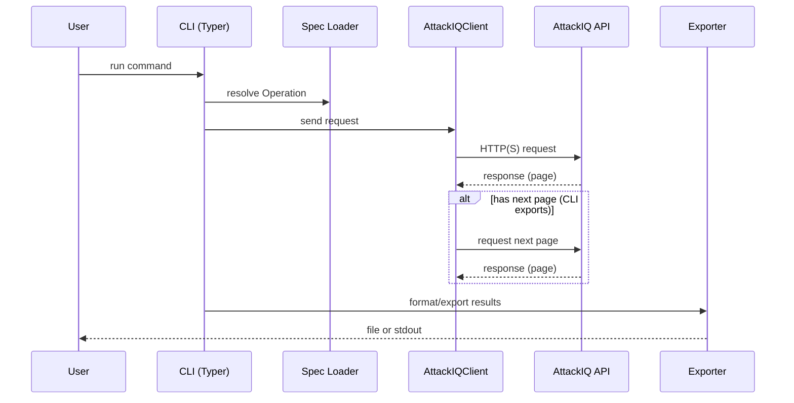

# Architecture Overview

## Purpose
The AttackIQ CLI provides a secure, schema-driven command line interface to the AttackIQ API.
It loads a bundled OpenAPI schema, validates parameters, and executes API requests with
safe defaults (timeouts, TLS verification, redacted logging).
The CLI defines capabilities, then abstractions. The TUI consumes those abstractions and
adds UI affordances while keeping endpoint interaction in shared services.

## System Context
- Users invoke `attackiq` commands locally.
- The CLI reads configuration and tokens from disk/env.
- Requests are sent to the AttackIQ API over HTTP(S).
- http:// base URLs are permitted when configured; TLS/insecure mode is surfaced in runtime diagnostics.
- The joiner consumes exported CSVs (AttackIQ + GitLab) and produces deterministic CSV outputs.

```mermaid
flowchart TD
    User[User CLI invocation] --> CLI[src/attackiq_cli/cli.py + src/attackiq_cli/__main__.py]
    CLI --> Services[src/attackiq_cli/services.py]
    Services --> Config[src/attackiq_cli/config.py]
    Services --> Spec[src/attackiq_cli/spec.py + src/attackiq_cli/openapi.yaml]
    Services --> Client[src/attackiq_cli/client.py]
    Client --> API[AttackIQ API]
    Config --> Services
    Spec --> Services
    CLI --> Exporter[src/attackiq_cli/exporter.py]
    TUI --> Exporter
    Exporter --> Output[CSV/JSON files]
    TUI[TUI (tui.py)] --> Services
    Joiner[Joiner (joiner/*)] --> Output
    CLI --> Output
    Client --> Logging[logging_utils.py]
```

## Major Components
- CLI entrypoints: `src/attackiq_cli/cli.py`, `src/attackiq_cli/__main__.py`
- TUI entrypoint: `src/attackiq_cli/tui.py`
- Configuration: `src/attackiq_cli/config.py`
- OpenAPI parsing: `src/attackiq_cli/spec.py` and bundled `src/attackiq_cli/openapi.yaml`
- API client + pagination: `src/attackiq_cli/client.py`
- Export workflows: `src/attackiq_cli/exporter.py`
- Joiner workflows: `src/attackiq_cli/joiner/*` (deterministic CSV joins)
- Service layer: `src/attackiq_cli/services.py`
- Logging utilities: `src/attackiq_cli/logging_utils.py`
- Utilities: `src/attackiq_cli/utils.py`
- Compatibility alias package: `src/aiq_cli/*` (backwards-compatible module path)

## Module Responsibilities
- `src/attackiq_cli/cli.py`: Typer command definitions, argument parsing, input validation, orchestration.
- `src/attackiq_cli/__main__.py`: CLI entrypoint wiring and version output.
- `src/attackiq_cli/tui.py`: Textual-based terminal UI for status, scenario/assessment/test/asset/settings list-detail workflows, and results views built on services abstractions.
- `src/attackiq_cli/config.py`: load/save config, env overrides, validation helpers.
- `src/attackiq_cli/spec.py`: parse OpenAPI, construct `Operation` objects, parameter lookup.
- `src/attackiq_cli/client.py`: HTTP client, auth header selection, safe-method retries, pagination
  helpers.
- `src/attackiq_cli/exporter.py`: export routines and formatting for datasets.
- `src/attackiq_cli/services.py`: shared orchestration for config/spec/client usage across CLI and TUI.
- `src/attackiq_cli/joiner/*`: deterministic join pipeline for AttackIQ exports + GitLab issues CSVs.
- `src/attackiq_cli/logging_utils.py`: structured logging helpers (text/JSON).
- `src/attackiq_cli/utils.py`: shared helpers for formatting and I/O.

## Key Data Structures
- `Operation` (from `spec.py`): normalized OpenAPI operation with path, method, parameters.
- `AuthContext` (from `client.py`): token storage and auth scheme selection.
- `AttackIQClient` (from `client.py`): request sender with safe-method retries and logging.
- `ScenarioFilters` (from `services.py`): normalized scenario list filters shared by CLI/TUI.
- Export rows (dicts): normalized records used for CSV/JSON output.

## Request and Pagination Flow


## Data Flow (Typical Request)
1. User runs a CLI command (Typer entrypoint).
2. CLI loads config and OpenAPI spec.
3. CLI resolves an `Operation` and validates inputs.
4. `AttackIQClient` builds headers and sends request via httpx.
5. Response is validated/serialized and written to stdout or file.

## Security and Reliability Defaults
- TLS verification is enabled by default; `--insecure` is explicit.
- Explicit request timeouts are required.
- Retries apply only to transient failures (timeouts/5xx/429).
- Authorization headers are redacted in logs.

## Configuration and Auth
- Config is persisted in a user config directory with env overrides.
- Auth tokens are stored locally or read from env vars.
- `AuthContext` selects the correct scheme per operation.

## Pagination
- List endpoints accept `page` and `page_size`; CLI export flows use `paginate_results` to iterate.
- TUI list/detail views fetch one page at a time and track `next` flags for paging.

## Logging
- `setup_logging` supports text or JSON formats.
- Structured logs include event names and redacted fields.

## Error Handling
- Validation errors raise `typer.BadParameter` to provide user-friendly CLI messages.
- HTTP errors raise `httpx.HTTPStatusError` and are surfaced with status codes.
- Retry logic applies to safe methods only (`GET`/`HEAD`/`OPTIONS`) for transient failures
  (timeouts/5xx/429).
- Configuration errors are surfaced early during CLI argument parsing.

## Scaling Considerations
- Use pagination (`page`/`page_size`) for list endpoints to avoid large responses.
- Prefer streaming export outputs instead of loading all results in memory.
- Respect API rate limits; rely on backoff/retries for transient failures on safe methods.

## Non-Goals
- Full SDK generation or codegen beyond the bundled OpenAPI schema.
- Automatic schema evolution without explicit updates to `openapi.yaml`.
- Handling arbitrary API retries beyond transient failure classes.

## Testing Strategy
- Unit tests live in `tests/` and focus on client behavior, spec parsing, and exporters.
- CLI behavior is validated through targeted tests and utilities.

## Extension Points
- Add new commands in `src/attackiq_cli/cli.py` with Typer.
- Add export helpers in `src/attackiq_cli/exporter.py`.
- Extend spec parsing in `src/attackiq_cli/spec.py` as schema needs grow.
- Add CLI abstractions in `src/attackiq_cli/services.py` for reuse by the TUI.

## Focused Deep Dives
- `attackiq call` runtime and validation contract: `docs/CALL_FLOW.md`.
- TUI runtime/state/cache/palette contract: `docs/TUI_FLOW.md`.
- Export and pagination contract: `docs/EXPORT_FLOW.md`.
- Joiner + DET pipeline contract: `docs/JOINER_FLOW.md`.
- Contract sources and verification scripts: `docs/contracts/*.yaml`,
  `scripts/render_deep_dives.py`, `scripts/verify_deep_dives.py`.
